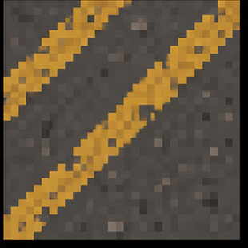
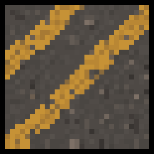
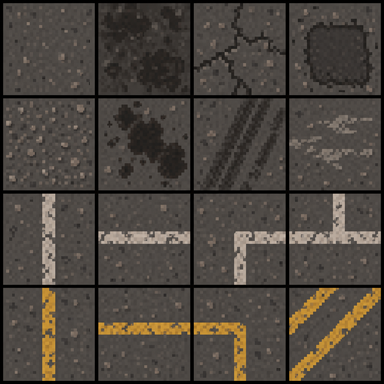
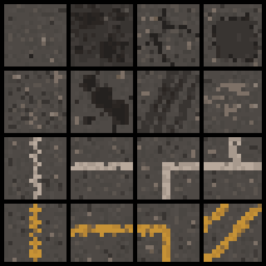
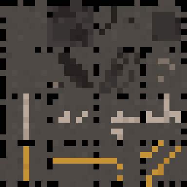
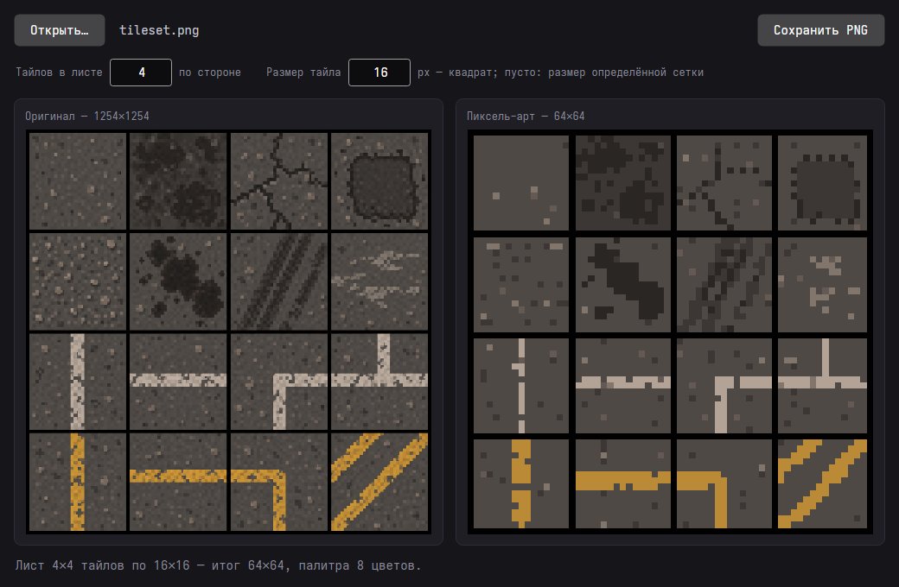

# asepix

Turns AI-generated "pixel art" into actual pixel art.

An image generator gives you something that reads as pixel art at a glance but isn't:
the blocks land on a fractional grid (19.6 pixels wide, not 20), every block is a
slightly different shade, and each edge is a soft anti-aliased ramp. asepix finds the
grid the picture was really drawn on, collapses every cell to a single pixel, and picks
its colour by majority vote from a quantised palette.

One tile, before and after — same size, so this is only the cleanup:

| Generated image | asepix |
| --- | --- |
|  |  |

## Tilesets

Tell asepix how many tiles the sheet holds and how big each one has to be, and every
tile lands on exactly that size — whatever grid the image turned out to be drawn on.
Tile boundaries are respected, so no tile's art bleeds into its neighbour.

| 1254×1254 in | `--sheet 4 --tile 16` → 64×64 | `--sheet 4 --tile 8` → 32×32 |
| --- | --- | --- |
|  |  |  |

Shrinking drops whole art pixels rather than blending neighbours into colours the
palette never had; growing repeats them.

## Window

```
dotnet run --project ui/asepix.Ui
```

Drop an image in, set the two sizes, save the PNG. The result pane scales
nearest-neighbour, so what you see is what you get. It converts with the default
8-colour palette — reach for the command line when a sheet needs more than that.



## Command line

```
dotnet run --project asepix.csproj -- tileset.png --sheet 4 --tile 16 --colors 24
```

```
asepix <input> [options]

-o, --output <path>  Output file (default: <input>_converted.png)
    --grid <W>x<H>   Grid read out of the source; detected from the image when omitted
    --sheet <n>      Tiles along each side of the sheet (default: 1)
    --tile <n>       Side of one tile in pixels; every tile is rescaled to it
    --colors <n>     Palette size, 2-256 (default: 8)
    --inset <f>      Cell fraction trimmed before voting, 0-0.49 (default: 0.25)
```

Leave `--tile` off and you get the grid as detected, one pixel per cell. Detection needs
distinct edges to work from; if the image is too smooth it says so, and `--grid` takes
over. `--colors` is the one thing that can't be inferred — 8 is fine for a sprite, a
textured sheet like the one above wants more.

## Build

```
dotnet build asepix.slnx
dotnet test asepix.slnx
```

Needs .NET 10. The converter is plain ImageSharp; the window is Avalonia.
